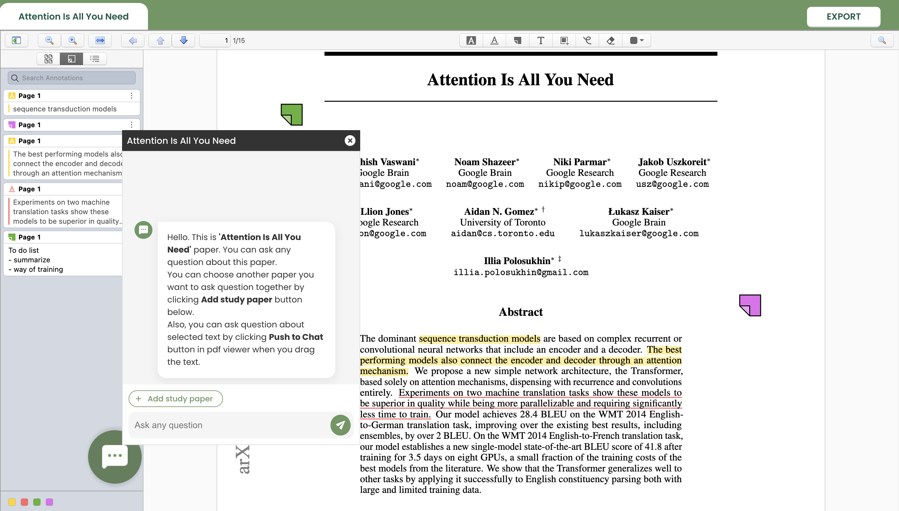
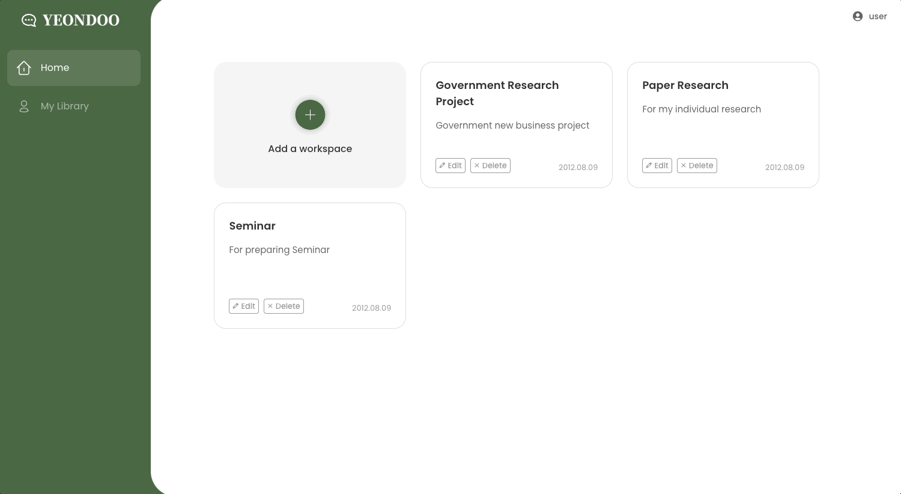
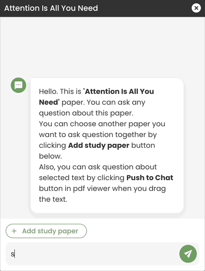

# YEONDOO (연두)

[](https://github.com/YEONDOO-swm/YEONDOO-fe/actions)

## 🔗 [Yeondoo 서비스 바로가기](https://yeondoo.net)


## Introduction
<p align="center">
  
  <div style="text-align: center; margin-top: 10px">
    연두는 연구를 도와주는 웹 서비스입니다. <br/>
    연두 서비스는 논문에 대한 노팅 및 하이라이팅 기능을 제공하는 워크북 공간이 있습니다. 뿐만 아니라, 채팅을 통해 논문을 깊이 이해할 수 있도록 도와줍니다.
  </div>
</p>

## Main feature

<table>
  <tr>
    <td valign="top">
      
    </td>
    <td valign="center">
      <div>
        개인 워크스페이스를 생성하여 자신만의 연구 공간을 관리할 수 있습니다.
      </div>
    </td>
  </tr>
</table>

<table>
  <tr>
    <td valign="top">
      
    </td>
    <td valign="center">
      <div>
        논문에 대해 궁금한 내용을 모두 질문할 수 있습니다. 논문 전체 컨텍스트를 임베딩하였기 때문에, 논문에 대한 질문을 정확하게 응답하여 줍니다.
      </div>
    </td>
  </tr>
</table>

## Tech Stacks
<p align="center">
  
  
  
  <br/>
  
  
  
  <br/><br/>
  
  
  <br/><br/>
  
  
  
  <br/><br/>
  
  
  
  <br/>
  
  


</p>

## How to start
### Clone
```
git clone https://github.com/YEONDOO-swm/YEONDOO-fe.git --recursive
```

Install the application dependencies by running:

```sh
npm install
```

### Set .env
```
VITE_REACT_APP_LOCAL_SERVER={Swagger api server}

VITE_READER_URL={zotero/pdf-worker url}

VITE_AMPLITUDE_ID={amplitude Id}

VITE_GOOGLE_CLIENT_ID={google client Id}
```


### Development

Start the application in development mode by running:

```sh
npm run dev
```

### Production

Build the application in production mode by running:

```sh
npm run build
```

## Members
|      임가윤       |          이석우         |       정찬호         |                                                                                                               
| :------------------------------------------------------------------------------: | :---------------------------------------------------------------------------------------------------------------------------------------------------: | :---------------------------------------------------------------------------------------------------------------------------------------------------------------------------------------------------: | 
|    <br/> [@coddingyun](https://github.com/coddingyun)   |                         <br/> [@ProgrammingLee](https://github.com/IHateChem)  |                    <br/> [@chjung99](https://github.com/chjung99)   |
|   Frontend, Team Lead   |   Backend  | AI |

## Contributors
### Software Maestro
- 한국산업연합회 주관
### Zotero
#### [zotero/pdf-worker](https://github.com/zotero/pdf-worker) 
- 해당 레포지토리에서 서브 모듈로 사용
#### [zotero/reader](https://github.com/zotero/reader) 
- [개인 레포지토리](https://github.com/coddingyun/yeondoo-pdf)에서 관리
- 서브도메인으로 Yeondoo와 통신

## License
연두는 GNU AFFERO GENERAL PUBLIC LICENSE를 따릅니다. 자세한 내용은 [LICENSE](https://github.com/YEONDOO-swm/YEONDOO-fe/blob/main/LICENSE)파일을 참고해주세요.


